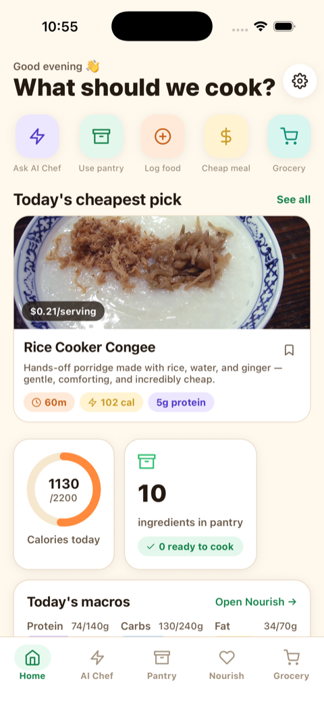
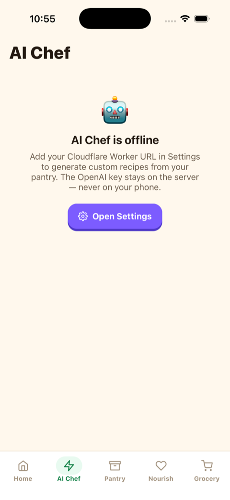
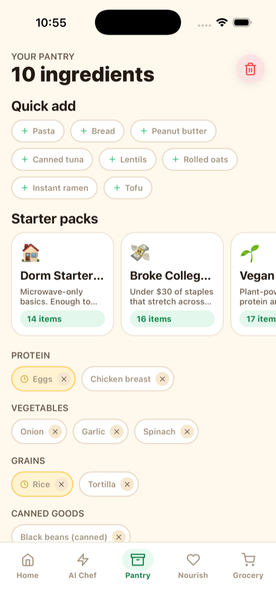
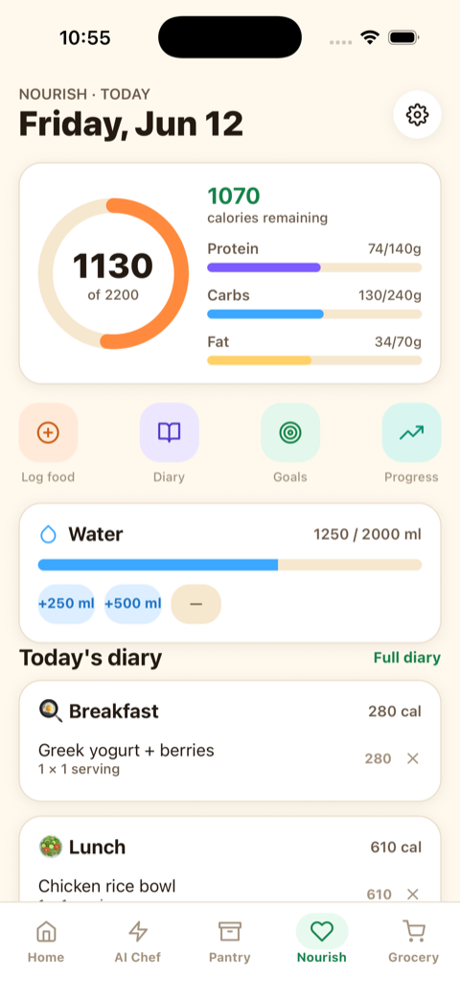
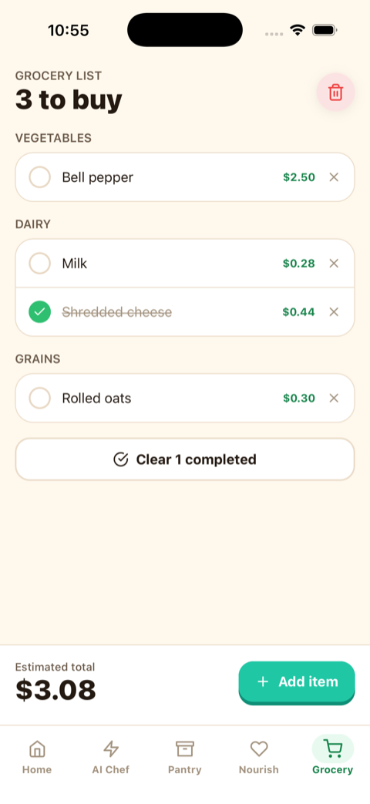
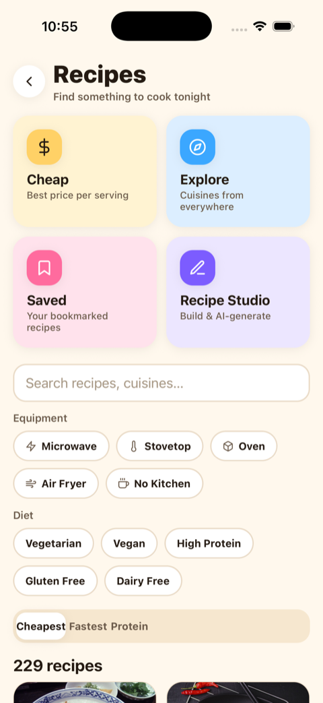
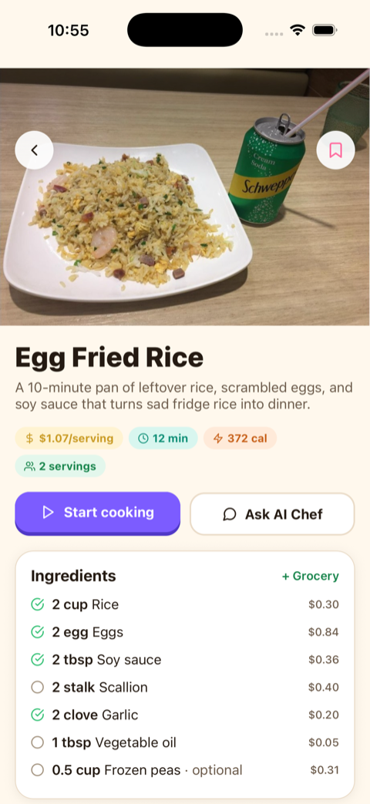
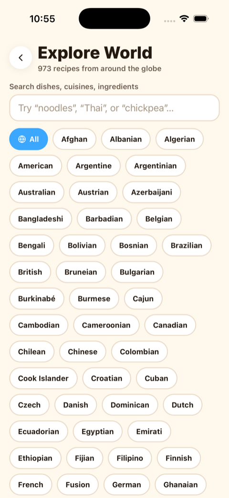
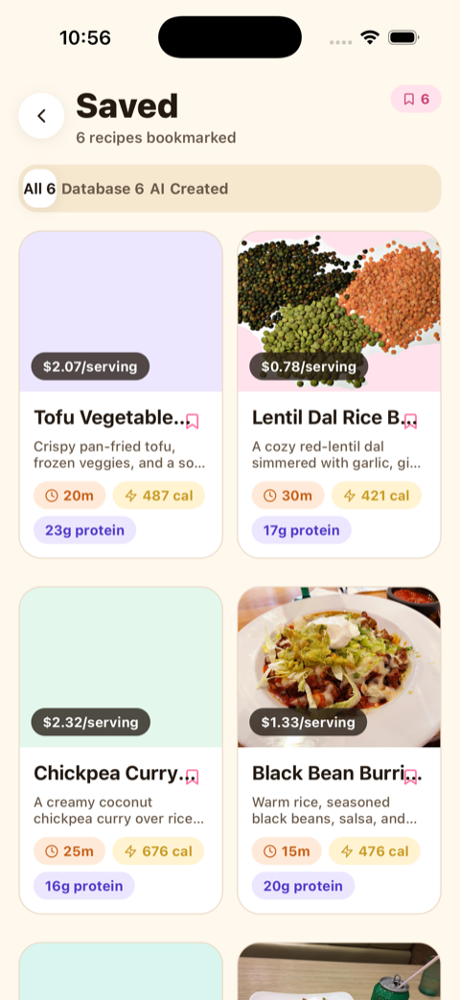
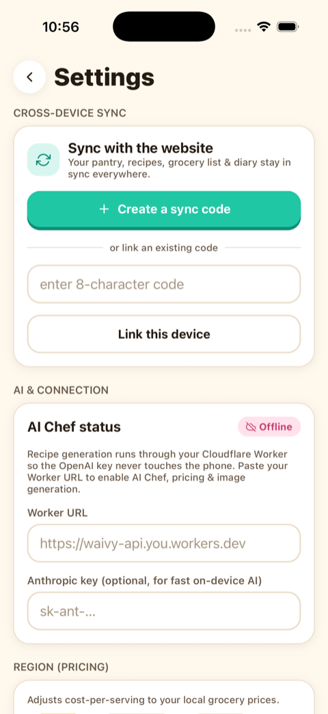

# 📱 Waivy iPhone app — screenshots

Captured live from the iOS simulator. These stay current automatically — they're
regenerated by [`mobile/scripts/capture-screenshots.sh`](../../mobile/scripts/capture-screenshots.sh)
(an in-app "tour mode" seeds demo data and walks every screen) and refreshed on
every push by the [`pre-push` git hook](../../.githooks/pre-push).

|  |  |  |  |
| :---: | :---: | :---: | :---: |
|  **Home** |  **AI Chef** |  **Pantry** |  **Nourish** |
|  **Grocery** |  **Recipes hub** |  **Recipe detail** |  **Guided cooking** |
|  **Cheap** |  **Explore** |  **Saved** |  **Settings** |
